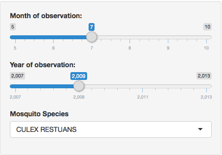
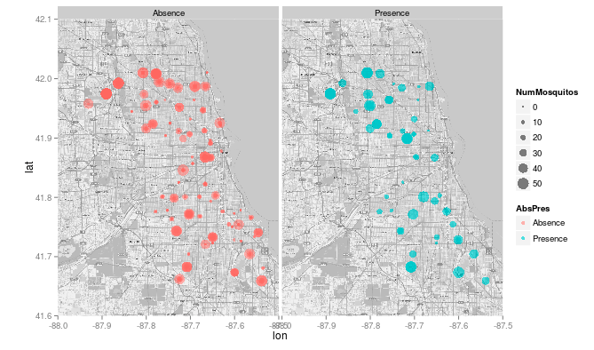

Devloping Data Products - Final Project
========================================================
author: David Williams
date: Tue May 12 10:37:56 2015
transition: rotate

Project Objective
========================================================

The final project for the Coursera course Developing Data Products is two-fold:

- Develop and deploy a shiny app
- Create and publish a presentation explaining the app

This presentation was created with R Presenter.

Shiny App Motivation
========================================================

The shiny app I developed uses data from a Kaggle contest to predict the presense of West Nile Virus based on data that was collected in the Chicago area.  The app allows exploration of date variables month and year as well as species of mosquito.  A heat map (or maps) showing the presense or absense of the virus along with the number of mosquitos collected are displayed.  These variables - date and species - are critical to understand in order to develop a prediction model for the contest.

More information on the Kaggle contest can be found [here](https://www.kaggle.com/c/predict-west-nile-virus)

The shiny app is deployed [here](https://dafwilli.shinyapps.io/heatMapApp/)


App Input
========================================================

***
Data for variables month and year can be input


|----------------------------------------|


Each mosquito species can be chosen seperately

App Output
========================================================
Data are displayed on the Chicago area map



Total Number of Mosquitos

```
[1] 1956
```
